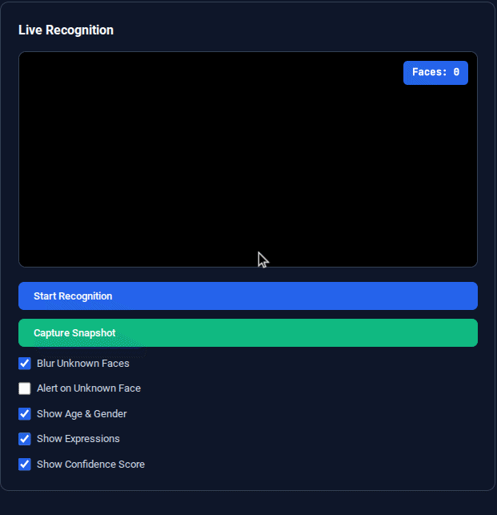
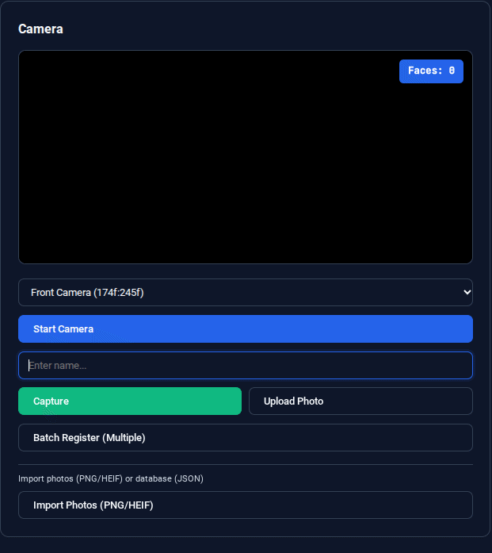

# *Face Recognition Web App*

A local, fully client-side face recognition system with live detection, face registration, face login, image comparison, anomaly detection, duplicate scanning, and intelligent auto-training.

Live Site:  
https://Aaks-hatH.github.io/face-rec

---

## Demo

### Live Recognition

### Camera and Registration

---

## Features

### Core Detection
- Real-time face recognition  
- Expression analysis  
- Age and gender estimation  
- Confidence scoring  
- Blur for unknown faces  
- Optional alerts for unknown faces  

### Face Registration
- Capture faces directly from the camera  
- Upload photos for registration  
- Batch registration (multiple images)  
- Automatic face detection during registration  
- Duplicate face detection  
- Manual name assignment and entry management  

### Face Login
A dedicated face-based authentication page allowing login using registered profiles.

### Two-Image Comparison
A tool that compares two uploaded images to evaluate face similarity.

---

## AI and Smart Systems

### Auto-Training System
Automatically improves recognition accuracy using live detections.
- Automatic sample collection  
- Confidence threshold control  
- Clear/reset training samples  

### Training Sample Management
- Collect only high-quality samples  
- Review or clear data  

### Face Tracking
- Continuous tracking of detected faces  
- Movement-path visualization  
- List of currently tracked faces  

### Anomaly Detection
Detects unexpected or unusual recognition patterns.
- Configurable detection rules  
- Anomaly event log  

### Duplicate Face Detection
Scan for and identify multiple registrations of the same face.
- Duplicate scanning  
- Merge or review flagged entries  

---

## Recognition Settings

Adjustable settings include:
- Blur unknown faces  
- Toggle age and gender display  
- Toggle expression recognition  
- Toggle confidence score  
- Unknown face alerts  
- Auto-training controls and threshold settings  

---

## UI and Experience

- Clean and responsive interface  
- Modern dark theme  
- Organized recognition, camera, settings, and analytics panels  
- Privacy-first design with full on-device processing  

---

## Privacy

All recognition is processed locally in the browser.  
No images, embeddings, or data are uploaded to external servers.

---

## License

MIT License
